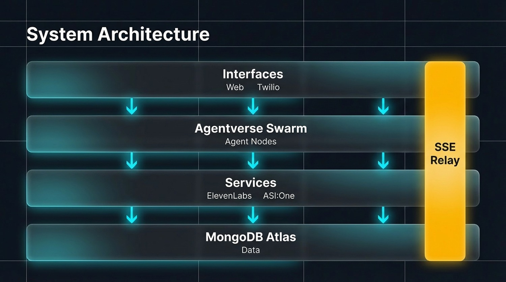
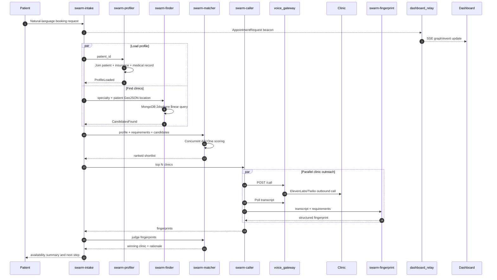

<div align="center">

# HealthSwarm

**A multilingual agent swarm that finds, calls, ranks, and helps book healthcare appointments.**

[](https://www.python.org/)
[](https://nextjs.org/)
[](https://www.typescriptlang.org/)
[](https://fastapi.tiangolo.com/)
[](https://www.mongodb.com/)
[](https://agentverse.ai/)
[](https://asi1.ai/)
[](https://elevenlabs.io/)
[](https://www.twilio.com/)
[](#license)

[Features](#features) - [Architecture](#architecture) - [Quick Start](#quick-start) - [API Reference](#api-reference) - [Project Structure](#project-structure) - [Contributing](#contributing)

</div>

---

## About

HealthSwarm is a healthcare appointment coordination system built as a six-agent swarm on Agentverse. A patient asks for care in natural language; the intake agent retrieves the patient profile, finds nearby clinics with MongoDB geospatial search, ranks candidates with ASI:One, calls the best clinics through ElevenLabs Conversational AI and Twilio, translates and fingerprints the call transcripts, and returns the best clinic plus booking context.

The project also includes a live Next.js war-room dashboard. It streams agent telemetry over Server-Sent Events, visualizes the swarm graph with React Flow, tracks outreach outcomes, and lets users upload patient documents into MongoDB GridFS.

> HealthSwarm is a demo/prototype. It uses synthetic patient records and should not be used for real medical decision-making, diagnosis, emergency triage, or storing real protected health information without a full compliance review.

---

## Features

| Feature | Description |
|:--------|:------------|
| **Agentverse Swarm** | Six mailbox-enabled uAgents registered on Agentverse with ASI:One chat protocol support |
| **Natural-Language Intake** | Parses patient requests into specialty, symptoms, urgency, schedule preferences, accessibility needs, tests, insurance, and language |
| **Patient Profiling** | Builds a flat patient view from MongoDB `patients`, `insurance_companies`, and AI-generated `medical_records` |
| **Geospatial Clinic Search** | Uses MongoDB `2dsphere` and `$near` queries against OSM-derived clinic data |
| **Concurrent Candidate Ranking** | Scores clinics in parallel with ASI:One using specialty, insurance, proximity, continuity, language, and accessibility signals |
| **Outbound Clinic Calling** | Calls top-ranked clinics concurrently through the local voice gateway and ElevenLabs Conversational AI |
| **Multilingual Voice Handling** | Sends patient language into the booking agent and fingerprints receptionist transcripts across languages |
| **Transcript Fingerprinting** | Translates call transcripts to English and extracts availability, insurance acceptance, wait time, key facts, and summary |
| **LLM Final Judge** | Uses ASI:One to pick the best clinic from structured call fingerprints |
| **Two-Phase Booking** | The OmegaClaw bridge first gathers availability, then confirms a slot after the patient replies `confirm` |
| **Live War-Room Dashboard** | Next.js dashboard visualizes agent beacons, animated graph edges, candidate nodes, payloads, and language alerts |
| **Outreach Console** | Persists and displays call outcomes, language matches, clinic details, summaries, and booking timestamps |
| **Patient Document Uploads** | Uploads files through FastAPI, stores binaries in GridFS, stores metadata in MongoDB, and emits dashboard beacons |
| **Demo Harnesses** | Includes simulation, rehearsal, database inspection, seeding, migration, and OmegaClaw setup scripts |

---

## Architecture



Four horizontal layers, top to bottom:

- **Interfaces** — Web (Next.js dashboard) + Twilio inbound
- **Agentverse Swarm** — the six agent nodes (intake, profiler, finder, matcher, caller, fingerprint)
- **Services** — ElevenLabs Conversational AI for the call leg + ASI:One for every LLM decision
- **MongoDB Atlas** — patients, clinics, medical_records, fingerprints, outreach_attempts, GridFS

All four layers stream live state through the **SSE Relay** on the right edge, which is what powers the real-time dashboard.

### Booking Flow



---

## Agent Registry

All HealthSwarm agents are configured for Agentverse, mailbox routing, and ASI:One chat support.

| Agent | Role | Local Runner | Port | Agentverse Address |
|:------|:-----|:-------------|:-----|:-------------------|
| `healthswarm-intake` | Orchestrates the swarm, exposes chat, OmegaClaw model protocol, and HTTP `/book` bridge | `agents.swarm_intake.uagent_runner` | `8010` + bridge `8015` | [`agent1qw8ycstyjepy0646l8kmwzgzx2msv9ajmu0t5742c2kp2v5vgnehv6z2wsu`](https://agentverse.ai/agents/agent1qw8ycstyjepy0646l8kmwzgzx2msv9ajmu0t5742c2kp2v5vgnehv6z2wsu) |
| `healthswarm-profiler` | Loads patient profile and caches it in-process | `agents.swarm_profiler.uagent_runner` | `8011` | [`agent1q0ftk9jz5lslz4l3glp4qa6yt77yxyk9e8ya9rmjzjq8u6zkzr467ksafvu`](https://agentverse.ai/agents/agent1q0ftk9jz5lslz4l3glp4qa6yt77yxyk9e8ya9rmjzjq8u6zkzr467ksafvu) |
| `healthswarm-finder` | Runs clinic search using MongoDB geospatial indexes | `agents.swarm_finder.uagent_runner` | `8012` | [`agent1qduz7y0f26t0ezgqtj57439w8yw2vrn9gmev79h2lf6n4sx7ymghguwse65`](https://agentverse.ai/agents/agent1qduz7y0f26t0ezgqtj57439w8yw2vrn9gmev79h2lf6n4sx7ymghguwse65) |
| `healthswarm-matcher` | Scores clinic candidates and judges call fingerprints | `agents.swarm_matcher.uagent_runner` | `8013` | [`agent1qghpy4860rfxus5ftzagkpwkyvcde8je69kszpz5zm7x02mtxtmlz0j46nc`](https://agentverse.ai/agents/agent1qghpy4860rfxus5ftzagkpwkyvcde8je69kszpz5zm7x02mtxtmlz0j46nc) |
| `healthswarm-fingerprint` | Translates and structures call transcripts | `agents.swarm_fingerprint.uagent_runner` | `8014` | [`agent1qdyyvylzsymr6w9r8zq7vwyyd2x8q87s3p6qhs063l2txqn4s4jg223yncw`](https://agentverse.ai/agents/agent1qdyyvylzsymr6w9r8zq7vwyyd2x8q87s3p6qhs063l2txqn4s4jg223yncw) |
| `healthswarm-caller` | Places calls, polls transcripts, persists fingerprints, and supports fallback attempts | `agents.swarm_caller.uagent_runner` | `8016` | Set by `CALLER_SEED` |

---

## Quick Start

### Prerequisites

- **Python** 3.10+; the pinned dependencies were tested with Python 3.12
- **Node.js** 18+ and npm
- **MongoDB Atlas** or local MongoDB with a `healthswarm` database
- **ASI:One API key** for all LLM extraction, ranking, matching, and transcript fingerprinting
- **Agentverse API key** and stable uAgent seed phrases
- **ElevenLabs Conversational AI** agent, phone number ID, and API key
- **Twilio phone number** imported/configured through ElevenLabs
- Optional: **Docker** for OmegaClaw Telegram integration
- Optional: **ngrok/pyngrok** if your voice gateway must receive public callbacks during a live phone demo

### 1. Clone and Install

```bash
git clone https://github.com/yourusername/kin.git
cd kin
```

**Windows PowerShell**

```powershell
py -3.12 -m venv .venv
.\.venv\Scripts\python -m pip install -r requirements.txt

cd healthswarm-dashboard
npm install
cd ..
```

**macOS / Linux**

```bash
python3 -m venv .venv
.venv/bin/python -m pip install -r requirements.txt

cd healthswarm-dashboard
npm install
cd ..
```

### 2. Configure Environment

Copy `.env.example` to `.env` and fill in the real values.

```env
# ElevenLabs Conversational AI
ELEVENLABS_API_KEY=sk_...
BOOKING_AGENT_ID=agent_xxxxxxxxxxxxxxxx
ELEVENLABS_PHONE_NUMBER_ID=phnum_xxxxxxxx
REPORT_BOOKING_TOOL_NAME=report_booking

# ASI:One
ASI_ONE_API_KEY=...

# Agentverse
AGENTVERSE_API_KEY=...
INTAKE_SEED=...
PROFILER_SEED=...
FINDER_SEED=...
MATCHER_SEED=...
CALLER_SEED=...
FINGERPRINT_SEED=...

# MongoDB
MONGO_URI=mongodb+srv://<user>:<pass>@<cluster>.mongodb.net/healthswarm?retryWrites=true&w=majority

# Local services
TELEMETRY_RELAY_URL=http://localhost:3001/telemetry
VOICE_GATEWAY_URL=http://localhost:8000
OMEGACLAW_BRIDGE_PORT=8015

# Tuning
FINDER_RADIUS_M=15000
FINDER_LIMIT=5
MATCHER_MAX_TOKENS=512
MATCHER_WORKERS=8
FINGERPRINT_MAX_TOKENS=384
CALL_TOP_N=3
CALL_POLL_INTERVAL_S=5
CALL_MAX_WAIT_S=150
MAX_FALLBACK_ATTEMPTS=3
DEMO_PHONE_FALLBACK=+1-555-DEMO
```

### 3. Seed MongoDB

```powershell
.\.venv\Scripts\python scripts\migrate_v2.py
.\.venv\Scripts\python scripts\ingest_clinics.py
.\.venv\Scripts\python scripts\profile_patient.py --all
.\.venv\Scripts\python scripts\inspect_db.py
```

On macOS/Linux, replace `.\.venv\Scripts\python` with `.venv/bin/python`.

What these scripts do:

| Script | Purpose |
|:-------|:--------|
| `scripts/migrate_v2.py` | Drops/reseeds v2 demo collections except `clinics` |
| `scripts/ingest_clinics.py` | Pulls LA and Mexico City healthcare facilities from Overpass/OSM and creates `2dsphere` indexes |
| `scripts/profile_patient.py --all` | Generates or caches synthetic AI medical records for demo patients |
| `scripts/inspect_db.py` | Prints patients, insurers, clinic counts, medical records, and a live geo-query sanity check |

### 4. Run the Local System

Open separate terminals from the repo root.

**Terminal 1 - Dashboard Relay**

```powershell
.\.venv\Scripts\python -m uvicorn dashboard_relay.main:app --port 3001
```

Health check:

```bash
curl http://localhost:3001/health
```

**Terminal 2 - Next.js Dashboard**

```bash
cd healthswarm-dashboard
npm run dev
```

Open `http://localhost:3000`.

**Terminal 3 - Voice Gateway**

```powershell
.\.venv\Scripts\python -m uvicorn voice_gateway.main:app --port 8000
```

Health check:

```bash
curl http://localhost:8000/health
```

**Terminal 4+ - Agentverse Agents**

Run individually while developing:

```powershell
$env:PYTHONPATH='.'
.\.venv\Scripts\python -m agents.swarm_intake.uagent_runner
.\.venv\Scripts\python -m agents.swarm_profiler.uagent_runner
.\.venv\Scripts\python -m agents.swarm_finder.uagent_runner
.\.venv\Scripts\python -m agents.swarm_matcher.uagent_runner
.\.venv\Scripts\python -m agents.swarm_caller.uagent_runner
.\.venv\Scripts\python -m agents.swarm_fingerprint.uagent_runner
```

Or start them in the background on macOS/Linux:

```bash
for agent in swarm_intake swarm_profiler swarm_finder swarm_matcher swarm_caller swarm_fingerprint; do
  PYTHONPATH=. .venv/bin/python -m agents.${agent}.uagent_runner >> /tmp/hs-${agent}.log 2>&1 &
done
```

---

## Demo Workflows

### Dashboard-Only Rehearsal

Runs the graph, mocked call events, language detection moment, and booking result without placing a real phone call.

```powershell
.\.venv\Scripts\python scripts\demo_rehearsal.py --patient joon-001
```

Other demo personas:

```powershell
.\.venv\Scripts\python scripts\demo_rehearsal.py --patient maria-001
.\.venv\Scripts\python scripts\demo_rehearsal.py --patient rahul-001
```

### Real Call Rehearsal

Requires the voice gateway, ElevenLabs phone number, and call-capable configuration.

```powershell
.\.venv\Scripts\python scripts\demo_rehearsal.py --real-call --to +1XXXXXXXXXX --patient joon-001
```

### Passive Backdrop Loop

Cycles demo telemetry through all personas so the dashboard stays active.

```powershell
.\.venv\Scripts\python scripts\sim_swarm.py --loop
```

### OmegaClaw Telegram Integration

```bash
bash scripts/setup_omegaclaw.sh
```

Then message the Telegram bot with examples such as:

```text
Book a dermatology appointment for Joon
Maria needs a Spanish-speaking primary care doctor this week
Rahul wants a cardiologist ASAP
```

---

## Project Structure

```text
kin/
|-- agents/
|   |-- swarm_intake/              # Orchestrator, Agentverse chat, OmegaClaw bridge
|   |-- swarm_profiler/            # Patient profile retrieval
|   |-- swarm_finder/              # MongoDB geospatial clinic search
|   |-- swarm_matcher/             # ASI:One candidate scoring and final judging
|   |-- swarm_caller/              # Voice gateway calls, polling, persistence
|   `-- swarm_fingerprint/         # Transcript translation and fact extraction
|
|-- common/
|   |-- asi.py                     # ASI:One OpenAI-compatible client helper
|   |-- geo.py                     # Haversine + city ETA approximation
|   |-- medical.py                 # Synthetic medical record generator/cache
|   |-- patient_cache.py           # In-process patient cache
|   |-- patient_view.py            # Flat profile adapter over v2 schema
|   |-- telemetry.py               # Non-blocking relay beacon helper
|   `-- transcript_store.py        # MongoDB fingerprint persistence/query helpers
|
|-- dashboard_relay/
|   `-- main.py                    # FastAPI SSE relay, uploads, outreach APIs
|
|-- healthswarm-dashboard/
|   |-- app/
|   |   |-- components/            # War-room graph, outreach table, upload panel, UI atoms
|   |   |-- lib/                   # Constants, types, formatting helpers
|   |   |-- globals.css            # Tailwind + React Flow styling
|   |   |-- layout.tsx             # Next metadata and fonts
|   |   `-- page.tsx               # Main dashboard shell
|   |-- package.json
|   |-- tailwind.config.ts
|   `-- tsconfig.json
|
|-- healthswarm-omegaclaw-skill/
|   |-- SKILL.md                   # OmegaClaw integration notes
|   |-- agentverse/
|   |   `-- healthswarm_skill.py   # HTTP bridge adapter for OmegaClaw
|   `-- skills.metta.snippet       # MeTTa registration snippet
|
|-- scripts/
|   |-- demo_rehearsal.py          # End-to-end demo runner
|   |-- sim_swarm.py               # Synthetic telemetry generator
|   |-- migrate_v2.py              # Rebuilds v2 demo schema
|   |-- ingest_clinics.py          # OSM/Overpass clinic ingestion
|   |-- profile_patient.py         # Generate/preview medical records
|   |-- inspect_db.py              # Read-only database sanity check
|   `-- setup_omegaclaw.sh         # Dockerized OmegaClaw skill injection
|
|-- voice_gateway/
|   |-- main.py                    # FastAPI call/transcript API
|   `-- eleven_caller.py           # ElevenLabs SDK integration
|
|-- .env.example
|-- AGENTS.md
|-- DEMO_RUNBOOK.md
|-- requirements.txt
`-- README.md
```

---

## API Reference

### Dashboard Relay - `dashboard_relay.main`

Runs on `http://localhost:3001` by default.

| Method | Endpoint | Description |
|:-------|:---------|:------------|
| `POST` | `/telemetry` | Receives agent beacons shaped as `{src, dst, kind, payload}` |
| `GET` | `/stream` | Server-Sent Events stream consumed by the dashboard |
| `GET` | `/health` | Relay liveness, buffered event count, and subscriber count |
| `GET` | `/patients` | Lists patient IDs, names, language, and insurance for dashboard selectors |
| `POST` | `/upload` | Uploads a patient document to GridFS and emits `DocumentUploaded` |
| `GET` | `/documents/{patient_id}` | Lists metadata for uploaded patient documents |
| `GET` | `/document/{doc_id}` | Streams one uploaded document from GridFS |
| `GET` | `/outreach/stats` | Aggregated outreach counts by outcome |
| `GET` | `/outreach` | Recent outreach attempts, optionally filtered by patient |
| `GET` | `/outreach/{outreach_id}` | Full outreach row with correlated beacon events |
| `GET` | `/transcript/{call_sid}` | Stored transcript/fingerprint by Twilio call SID |
| `GET` | `/fingerprints/{patient_id}` | Fingerprints for a patient, newest first |
| `GET` | `/fingerprint/{fingerprint_id}` | Single fingerprint document |

### Voice Gateway - `voice_gateway.main`

Runs on `http://localhost:8000` by default.

| Method | Endpoint | Description |
|:-------|:---------|:------------|
| `POST` | `/call` | Starts an outbound ElevenLabs/Twilio call with patient dynamic variables |
| `GET` | `/transcript/{call_sid}` | Returns `202` while in progress, then transcript and booking result when done |
| `GET` | `/health` | Reports gateway health and whether required ElevenLabs IDs are configured |

Example `/call` body:

```json
{
  "to": "+15551234567",
  "language": "Korean",
  "patient_name": "Joon Kim",
  "patient_id": "joon-001",
  "specialty": "dermatologist",
  "problem": "persistent rash",
  "insurance": "Aetna",
  "tests_needed": "none",
  "time_pref": "morning",
  "clinic_name": "Your Laser Skin Care"
}
```

### Intake HTTP Bridge - `agents.swarm_intake.uagent_runner`

Runs on `http://localhost:8015` by default and is used by OmegaClaw.

| Method | Endpoint | Description |
|:-------|:---------|:------------|
| `POST` | `/book` | Phase 1 gathers availability; Phase 2 confirms booking when the query is a confirmation |

Example:

```json
{
  "query": "Book a dermatology appointment for Joon this week"
}
```

---

## Data Model

| Collection | Owner | Purpose |
|:-----------|:------|:--------|
| `patients` | `scripts/seed_patients.py` | Slim demographics, primary language, insurance reference, emergency contact, GeoJSON location |
| `insurance_companies` | `scripts/seed_insurance_companies.py` | Insurer reference data, plan types, service states, prior-auth specialties, formulary URL |
| `clinic_insurance` | `scripts/seed_clinic_insurance.py` | Demo mapping of clinic names to accepted insurer IDs |
| `clinics` | `scripts/ingest_clinics.py` | OSM-derived healthcare facilities with `2dsphere` geospatial index |
| `medical_records` | `common.medical` | Synthetic AI-generated records cached per patient |
| `fingerprints` | `common.transcript_store` | Structured call summaries, translated transcript, key facts, and raw fingerprint payload |
| `patient_documents` | `dashboard_relay.main` | Metadata for uploaded patient files |
| `fs.files` / `fs.chunks` | GridFS | Binary patient document storage |
| `outreach_attempts` | `dashboard_relay.main` | Correlated beacons for dashboard outreach history and stats |

### Demo Personas

| Patient ID | Name | Language | Location | Insurance | Typical Specialty |
|:-----------|:-----|:---------|:---------|:----------|:------------------|
| `maria-001` | Maria Gonzalez | Spanish | Boyle Heights, Los Angeles | Blue Shield PPO | Primary care |
| `joon-001` | Joon Kim | Korean | Koreatown, Los Angeles | Aetna HMO | Dermatology |
| `rahul-001` | Rahul Sharma | Hindi | Artesia, Los Angeles | Cigna PPO | Cardiology |

---

## Tech Stack

### Agent and Backend Layer

| Layer | Technology |
|:------|:-----------|
| Agent runtime | Fetch.ai `uagents` |
| Agent discovery/messaging | Agentverse mailbox + ASI:One chat protocol |
| LLM provider | ASI:One OpenAI-compatible API, model `asi1` |
| HTTP services | FastAPI + Uvicorn |
| Telephony/voice | ElevenLabs Conversational AI with Twilio outbound calling |
| Database | MongoDB Atlas, GridFS, `2dsphere` geospatial indexes |
| Data ingestion | OpenStreetMap Overpass API |
| Python dependencies | Pinned in `requirements.txt` |

### Frontend Layer

| Layer | Technology |
|:------|:-----------|
| Framework | Next.js 15 App Router |
| Language | TypeScript 5.5 |
| UI | React 18, Tailwind CSS, custom components |
| Graph visualization | React Flow |
| Icons | Lucide React |
| Live updates | Browser `EventSource` consuming FastAPI SSE |

---

## Configuration Reference

| Variable | Used By | Description |
|:---------|:--------|:------------|
| `ELEVENLABS_API_KEY` | Voice gateway | ElevenLabs SDK key with Conversational AI read/write scopes |
| `BOOKING_AGENT_ID` | Voice gateway | ElevenLabs Conversational AI agent ID |
| `ELEVENLABS_PHONE_NUMBER_ID` | Voice gateway | ElevenLabs phone number ID for Twilio outbound calls |
| `REPORT_BOOKING_TOOL_NAME` | Voice gateway | Tool call name parsed from ElevenLabs transcripts; defaults to `report_booking` |
| `ASI_ONE_API_KEY` | Agents, medical generator | ASI:One key for `asi1` chat completions |
| `AGENTVERSE_API_KEY` | uAgent runners | Publishes agent details and mailbox-enabled manifests |
| `*_SEED` | uAgent runners | Stable seed phrase used to derive each agent address |
| `MONGO_URI` | All data services | MongoDB connection string |
| `TELEMETRY_RELAY_URL` | Agents/scripts | Beacon target; defaults to `http://localhost:3001/telemetry` |
| `VOICE_GATEWAY_URL` | `swarm-caller` | Call/transcript gateway; defaults to `http://localhost:8000` |
| `VOICE_GW_TIMEOUT` | `swarm-caller` | Timeout for call placement |
| `FINDER_RADIUS_M` | `swarm-finder` | Clinic search radius in meters |
| `FINDER_LIMIT` | `swarm-finder` | Max clinic candidates returned |
| `MATCHER_WORKERS` | `swarm-matcher` | Number of parallel scoring workers |
| `CALL_TOP_N` | `swarm-intake` | Number of ranked clinics to call concurrently |
| `CALL_POLL_INTERVAL_S` | `swarm-caller` | Delay between transcript polls |
| `CALL_MAX_WAIT_S` | `swarm-caller` | Max call polling window |
| `MAX_FALLBACK_ATTEMPTS` | `swarm-caller` | Sequential fallback limit for `call_ranked` |
| `DEMO_PHONE_FALLBACK` | Matcher/caller/scripts | Placeholder number when OSM data lacks a phone |
| `TG_BOT_TOKEN` | OmegaClaw setup | Telegram bot token for Dockerized OmegaClaw |
| `OMEGACLAW_BRIDGE_PORT` | Intake/OmegaClaw | Local HTTP bridge port; defaults to `8015` |

---

## Verification and Diagnostics

| Check | Command |
|:------|:--------|
| Relay health | `curl http://localhost:3001/health` |
| Voice gateway health | `curl http://localhost:8000/health` |
| Database state | `python scripts/inspect_db.py` |
| Generate one profile | `python scripts/profile_patient.py joon-001 --force` |
| Run dashboard demo | `python scripts/demo_rehearsal.py --patient joon-001` |
| Run passive graph loop | `python scripts/sim_swarm.py --loop` |
| Monitor relay/gateway | `bash scripts/health.sh` |

Common recovery paths:

| Symptom | Likely Cause | Fix |
|:--------|:-------------|:----|
| Dashboard status stays `Connecting` | Relay is not running | Start `dashboard_relay.main` on port `3001` |
| No patients in upload selector | MongoDB not seeded or `MONGO_URI` missing | Run `scripts/migrate_v2.py` and verify `.env` |
| Finder returns no clinics | `clinics` collection empty or missing index | Run `scripts/ingest_clinics.py` |
| Calls fail immediately | ElevenLabs IDs/API key missing or gateway down | Check `/health` and `.env` voice variables |
| Transcripts never resolve | Call still active or call SID expired from in-memory gateway registry | Increase `CALL_MAX_WAIT_S` or rerun call |
| Agentverse address changed | Seed phrase changed | Restore shared seed values in `.env` |

---

## Safety Notes

- The project generates **synthetic** medical records for fictional demo patients.
- The matcher is a scheduling/ranking assistant, not a diagnostic or treatment engine.
- The code should not be deployed with real patient data until privacy, security, consent, audit logging, retention, and HIPAA/BAA requirements are reviewed.
- `.env` contains sensitive API keys and seed phrases. Keep it out of Git.
- OSM clinic data may be incomplete, stale, duplicated, or missing phone numbers.
- `DEMO_PHONE_FALLBACK` is for demos only and should never be used in production calling logic.

---

## Contributing

1. Fork the repository.
2. Create a feature branch: `git checkout -b feat/your-feature`.
3. Install Python and dashboard dependencies.
4. Keep agent contracts stable unless the corresponding caller/dashboard code is updated.
5. Run `scripts/inspect_db.py` and the relevant demo script before opening a PR.
6. Commit with a clear message: `git commit -m "feat: add your feature"`.
7. Push and open a Pull Request.

---

## License

No license file is currently included in this repository. Add a `LICENSE` file before distributing or reusing this code outside the project team.

---

<div align="center">

**[Back to Top](#healthswarm)**

</div>
